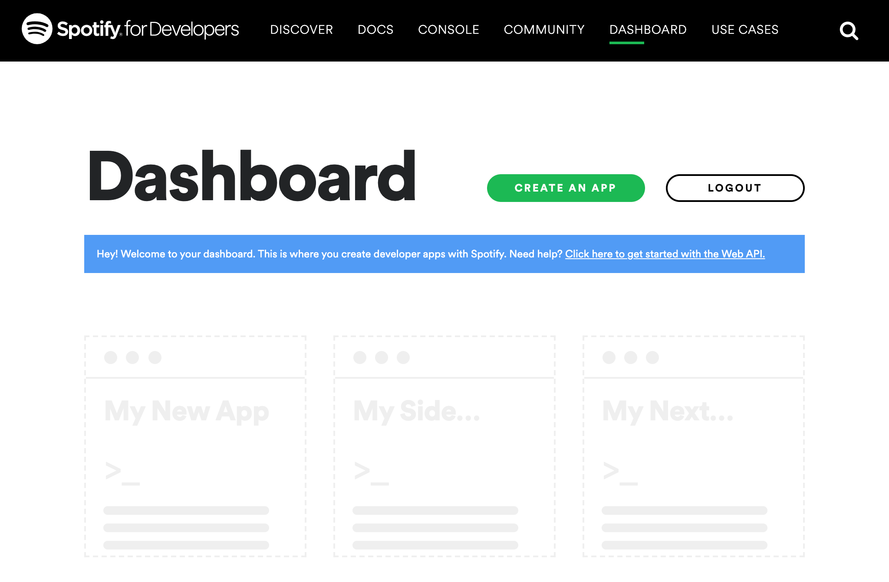
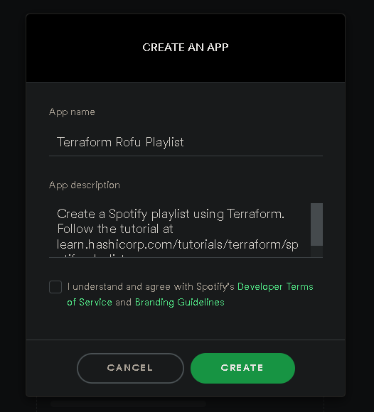
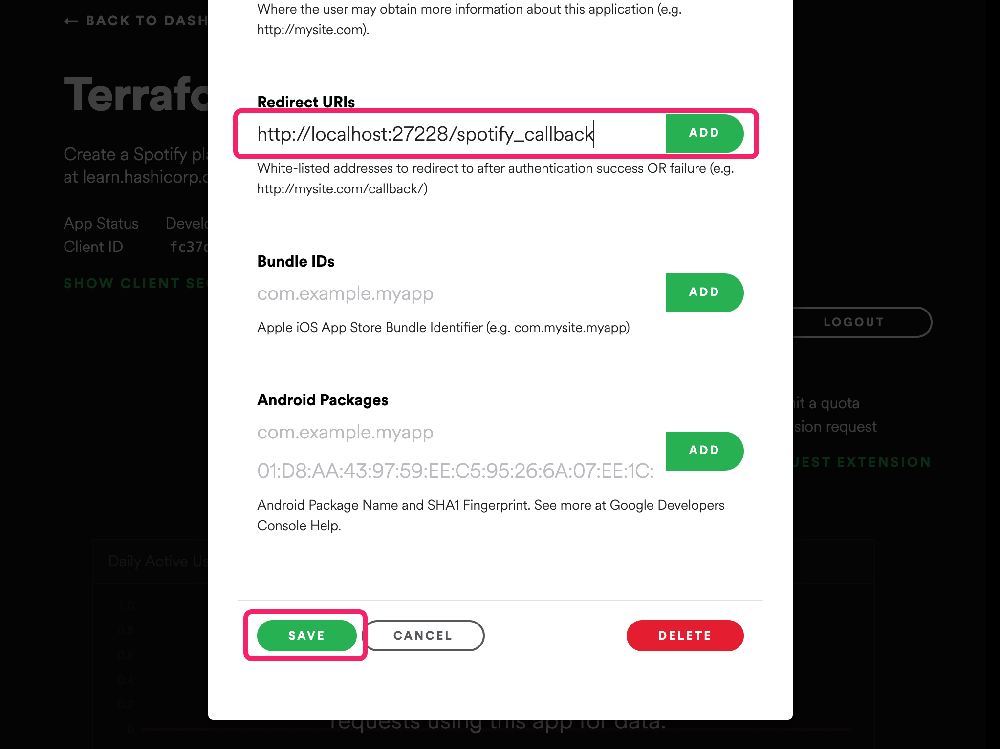

# 1- Login to the Spotify developer dashboard. 

!! Eğer Türkçe Readme'yi kontrol etmek isteseniz yukarıdan README_TR.md dosyasına bakabilirsiniz. 

```bash
https://developer.spotify.com/dashboard/applications
```


- Click the green Create an app button.

- Fill out the name and description according to the table below, check the box to agree to the terms of services, then click Create.

Name                       | Description
-------------------------- | -------------
Terraform Playlist Demo    | Create a Spotify playlist using Terraform. Follow the tutorial at learn.hashicorp.com/tutorials/terraform/spotify-playlist

                              

- Once Spotify creates the application, find and click the green Edit Settings button on the top right side.

- Copy the URI below into the Redirect URI field and click Add so that Spotify can find its authorization application locally on port 27228 at the correct path.    Scroll to the bottom of the form and click Save.

```bash
 http://localhost:27228/spotify_callback
```


# 2- Run authorization server

- Now that you created the Spotify app, you are ready to configure and start the authorization proxy server, which allows Terraform to interact with Spotify.


- Return to your terminal and set the redirect URI as an environment variable, instructing the authorization proxy server to serve your Spotify access tokens on port 27228.

```bash
$ export SPOTIFY_CLIENT_REDIRECT_URI=http://localhost:27228/spotify_callback
```

-Next, create a file called .env with the following contents to store your Spotify application's client ID and secret.

```bash
SPOTIFY_CLIENT_ID=
SPOTIFY_CLIENT_SECRET=
```

- Copy the Client ID from the Spotify app page underneath your app's title and description, and paste it into .env as your SPOTIFY_CLIENT_ID.


- Click Show client secret and copy the value displayed into .env as your SPOTIFY_CLIENT_SECRET.

- Make sure Docker Desktop is running, and start the server. It will run in your terminal's foreground.

```bash
$ docker run --rm -it -p 27228:27228 --env-file ./.env ghcr.io/conradludgate/spotify-auth-proxy
```


- Visit the authorization server's URL by visiting the link that your terminal output lists after Auth:.

- The server will redirect you to Spotify to authenticate. After authenticating, the server will display 

```bash
Authorization successful
```
indicating that the Terraform provider can use the server to retrieve access tokens.

- Leave the server running.

# 3- Clone example repository

- Clone the example Terraform configuration for this tutorial. It contains a complete Terraform configuration that searches for songs by Cem Adrian, and creates a playlist out of them.

```bash
$ git clone https://github.com/usuladams/spotify_terraform.git
```

- Change into the directory.

```bash
$ cd spotify_terraform
```

# 4- Set the API key

- Rename the terraform.tfvars.example file terraform.tfvars so that Terraform can detect the file.

```bash
 mv terraform.tfvars.example terraform.tfvars
```

- The .gitignore file in this repository excludes files with the .tfvars extension from version control to prevent you from accidentally committing your credentials.

```bash
Warning: Never commit sensitive values to version control.
```

- Find the terminal window where the Spotify authorization proxy server is running and copy the APIKey from its output.

- Open terraform.tfvars, and replace ... with the key from the proxy, so that Terraform can authenticate with Spotify. Save the file.

```bash
spotify_api_key = "..."
```

- This variable is declared for you in variables.tf.

```bash
variable "spotify_api_key" {
  type        = string
  description = "Set this as the APIKey that the authorization proxy server outputs"
}
```

# 5- Install the Spotify provider

- In your terminal, initialize Terraform, which will install the Spotify provider.

```bash
$ terraform init
```

# 6- Create the playlist

- Now you are ready to create your playlist. Apply your Terraform configuration. Terraform will show you the changes it plans to make and prompt for your approval.

- Run `terraform apply`. 

```bash
terraform apply
```
- Confirm the apply with a yes, and Terraform will create your playlist.

```txt
Do you want to perform these actions?
  Terraform will perform the actions described above.
  Only 'yes' will be accepted to approve.

  Enter a value: yes
```

# 7- Listen to your playlist

- Open the playlist URL returned in the Terraform output and enjoy your playlist!

