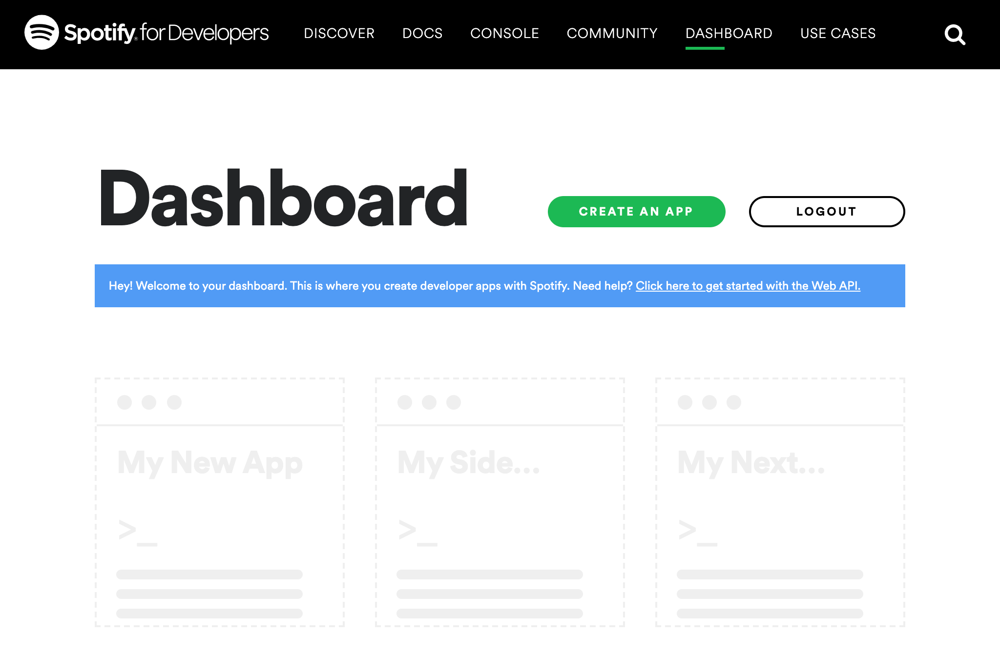
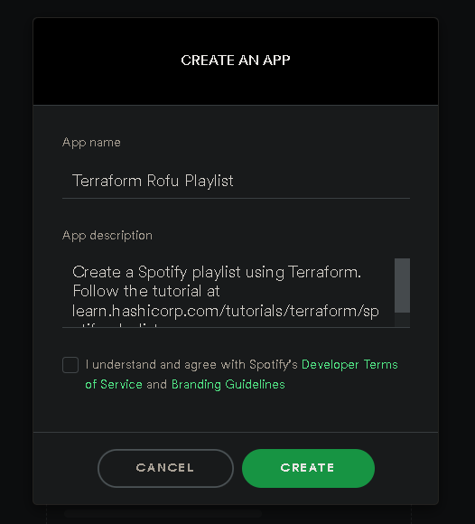
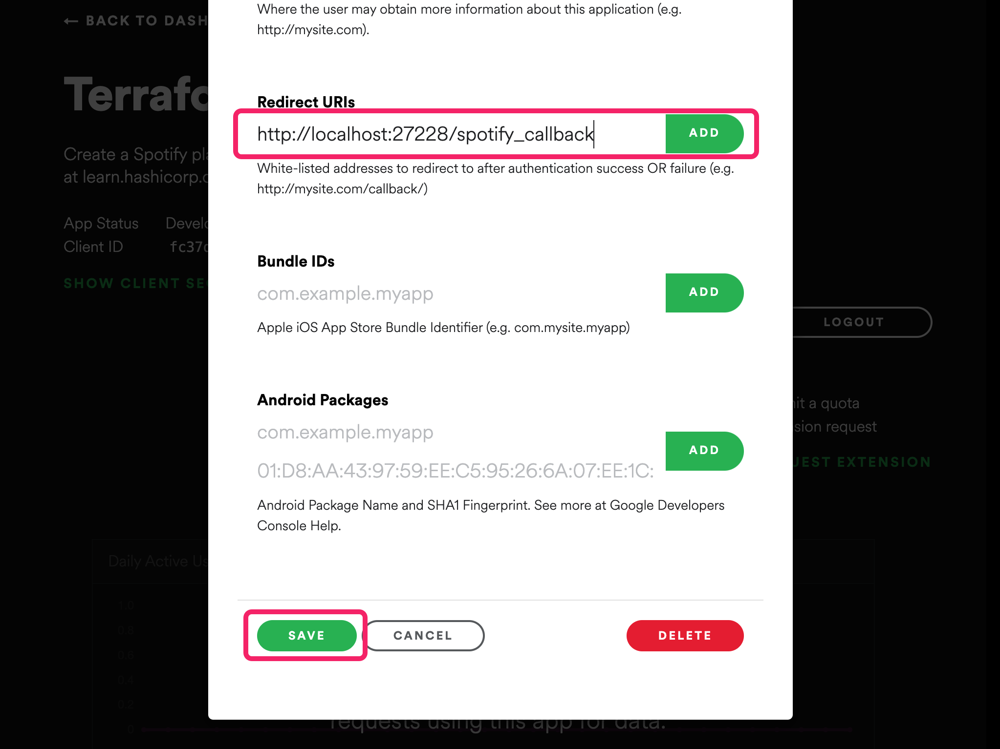
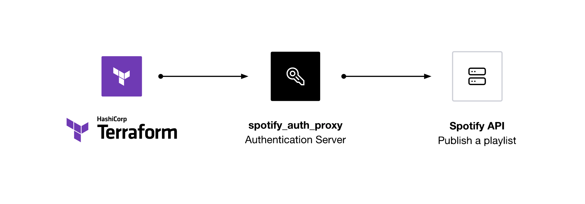
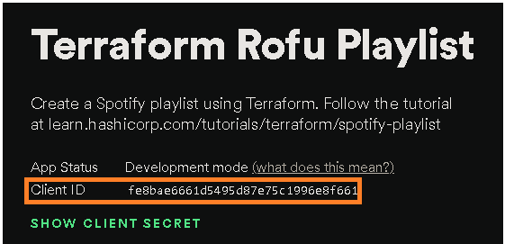
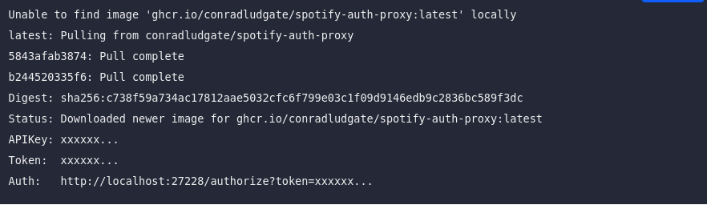
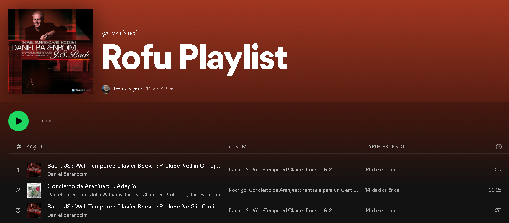

# 1- Spotify developer dashboard 

Aşağıdaki linke tıklayın ve giriş yapın.

```bash
https://developer.spotify.com/dashboard/applications
```


- Login olun. 

- Yeşil Create an App butonuna tıklayın.

- Aşağıdaki tabloya göre name ve description doldurunuz. Anladım ve Kabul ediyorum checkbox una tıklayınız. Sonrasında Create tıklayınız.

Name                       | Description
-------------------------- | -------------
Terraform Playlist Demo    | Create a Spotify playlist using Terraform. Follow the tutorial at learn.hashicorp.com/tutorials/terraform/spotify-playlist
                                                                                                                 


- Spotify uygulamayı oluşturduktan sonra sağ üst taraftaki yeşil Edit Settings butonuna tıklayınız.

- Aşağıdaki URI'yi Redirect URIs alanına kopyalayın ve ADD butonuna tıklayın, böylece Spotify yetkilendirme uygulamasını yerel olarak 27228 numaralı bağlantı portuna iletebilir. Formun en altına gidin ve SAVE butonuna tıklayın. 

```bash
 http://localhost:27228/spotify_callback
```



# 2- Kimlik Yetkilendirmesi(authorization) için server çalıştırma

- Artık Spotify uygulamasını oluşturduğunuza göre, Terraform'un Spotify ile etkileşime girmesini sağlayan yetkilendirme proxy sunucusunu yapılandırmaya ve başlatmaya hazırsınız.



- Terminalinize geri dönün ve yetkilendirme proxy sunucusuna Spotify access token larını 27228 numaralı porta sunması talimatını vererek yönlendirme URI'sini bir ortam değişkeni olarak ayarlayın.

```bash
$ export SPOTIFY_CLIENT_REDIRECT_URI=http://localhost:27228/spotify_callback
```

- .env isimli bir dosya oluşturun. İçerisine Spotify application's client ID and secret değerlerini giriniz.

```bash
SPOTIFY_CLIENT_ID=
SPOTIFY_CLIENT_SECRET=
```

- app's title and description altındaki Spotify App sayfasından Client ID kopyalayın. ve SPOTIFY_CLIENT_ID olarak .env dosyası içine yapıştırın.



- Show client secret tıklayın ve .env dosyasının içindeki SPOTIFY_CLIENT_SECRET değeri olarak yapıştırın.

- PC nizde Docker veya Docker Desktop un yüklü olduğundan emin olun ve Docker başlatın. Daha sonra terminalinizde aşağıdaki komut satırını çalıştırın. .env dosyasının olduğu dizinde olduğunuzdan emin olun. 

```bash
$ docker run --rm -it -p 27228:27228 --env-file ./.env ghcr.io/conradludgate/spotify-auth-proxy
```


- Auth:'dan sonra terminal çıktınızın listelediği bağlantıyı ziyaret ederek yetkilendirme sunucusunun URL'sini ziyaret edin. 

- Sunucu, kimlik doğrulaması için sizi Spotify'a yönlendirecek. Kimlik doğrulamasından sonra sunucu, Terraform sağlayıcısının erişim belirteçlerini almak için sunucuyu kullanabileceğini belirten Yetkilendirme başarılı mesajını gösterecektir. Aşağıdaki mesajı gördüğünüzden emin olun. 

```bash
Authorization successful
```
- Sunucuyu çalışır durumda bırakın.

# 3- Örnek Repository

- Bu eğitim için örnek Terraform dosyasını klonlayın. Cem Adrian, Melek Moso, Manuş Baba ve bir çok sanatçının şarkılarını arayan ve bunlardan bir çalma listesi oluşturan eksiksiz bir Terraform dosyasını içerir.

```bash
$ git clone https://github.com/usuladams/spotify_terraform.git
```

- dizini değiştirin.

```bash
$ cd spotify_terraform
```

# 4- API key konfigürasyonu

- terraform.tfvars.example dosyasının ismini terraform.tfvars olarak değiştirin.Terraform dosyayı bu isimle tanıyacaktır.

```bash
 mv terraform.tfvars.example terraform.tfvars
```

- Bu repository deki .gitignore dosyası, kimlik bilgilerinizi (credentials) yanlışlıkla commit etmenizi önlemek için .tfvars uzantılı dosyaları git vb. repolara göndermez.

```bash
UYARI: Git vb repolara hassas verilerinizi asla commit etmeyiniz.
```

- Spotify authorization proxy server ın çalıştığı terminal penceresini açın ve output taki APIKey i kopyalayın.

- terraform.tfvars dosyasını açın, ve ... yazan yere APIKey inizi yapıştırın. Böylece Terraform, Spotify ile kimlik doğrulaması(authenticate) yapabilir. Daha sonra dosyayı kaydet.


```bash
spotify_api_key = "..."
```

- Bu değişken variables.tf dosyasında belirtilmiştir..

```bash
variable "spotify_api_key" {
  type        = string
  description = "Set this as the APIKey that the authorization proxy server outputs"
}
```

# 5- Spotify Provider Yükle

- Terminalinizde, Spotify providerını yükleyecek olan Terraform'u başlatın.


```bash
$ terraform init
```

# 6- Playlist Oluştur

- Artık oynatma listenizi oluşturmaya hazırsınız. Terraform yapılandırmanızı uygulayın. Terraform, yapmayı planladığı değişiklikleri size gösterecek ve onayınızı isteyecektir.

- Run `terraform apply`. 

```bash
terraform apply
```
- Yes ile onaylayın ve Terraform playlistinizi oluşturacaktır.

```txt
Do you want to perform these actions?
  Terraform will perform the actions described above.
  Only 'yes' will be accepted to approve.

  Enter a value: yes
```

Çalma listesi oluştur


# 7- Playlist inizi Dinleyin...

- Terraform çıktısında döndürülen oynatma listesi URL'sini açın ve oynatma listenizin keyfini çıkarın!

